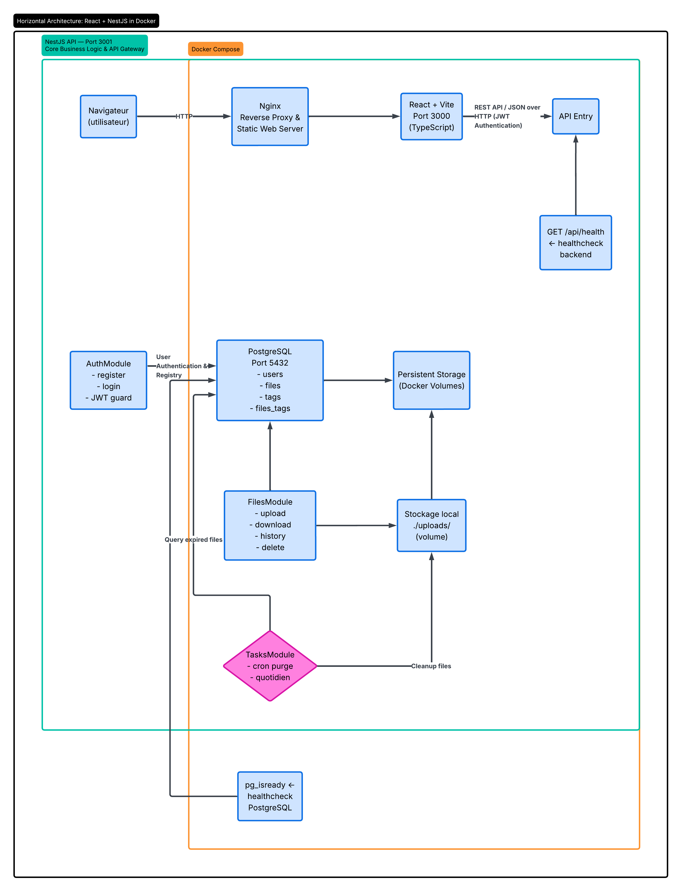

# DataShare

Un outil simple pour partager des fichiers avec des liens temporaires et sécurisés.

L'idée de DataShare est de pouvoir envoyer un fichier rapidement, en ajoutant un mot de passe si besoin, et en décidant quand le lien doit expirer. Une fois le temps écoulé, le fichier n'est plus accessible.

---

## Aperçu de l'interface

### Phase 1 — Authentification

| Accueil | Connexion | Inscription |
|:---:|:---:|:---:|
|  |  |  |

---

### Phase 2 — Téléversement de fichiers (US01)


---

### Phase 3 — Téléchargement & partage (US02)


---

## Architecture technique



---

## Stack technique

| Couche | Technologie | Version |
|:---|:---|:---|
| **Backend** | NestJS + TypeScript | v11 |
| **Frontend** | React + Vite | v19 / v8 |
| **Base de données** | PostgreSQL | v16 Alpine |
| **Auth** | JWT + Bcrypt | - |
| **Tests Unitaires** | Jest (backend) / Vitest (frontend) | - |
| **Tests E2E** | Cypress | - |
| **CI/CD** | GitHub Actions | - |
| **Conteneurs** | Docker + Docker Compose | - |

---

## Sécurité

- 🔒 Mots de passe hachés avec **bcrypt** (12 rounds).
- 🎫 Sessions gérées via **JWT** (token en mémoire, pas de localStorage).
- 🔗 Liens de partage avec **UUID v4** (impossibles à deviner).
- ⏱️ Expiration configurable par fichier.

---

## Installation rapide

### Prérequis
- Docker et Docker Compose installés.
- Node.js v24+ (optionnel, pour le développement local sans Docker).

### Lancer le projet

```bash
# 1. Copier la configuration
cp .env.example .env

# 2. Démarrer tous les services
docker compose up --build
```

L'application est accessible sur :
- **Interface** : `http://localhost:3000`
- **API** : `http://localhost:3001/api`
- **Santé** : `http://localhost:3001/api/health`

---

## Tests

```bash
# Unitaires (backend)
cd backend && npm run test

# Couverture (backend)
cd backend && npm run test:cov

# Intégration E2E (backend)
cd backend && npm run test:e2e

# Unitaires (frontend)
cd frontend && npm run test

# E2E Cypress — à venir
npx cypress run
```

> Voir [TESTING.md](./TESTING.md) pour la stratégie complète de tests.

---

## Avancement des phases

| Phase | Contenu | Statut | Tag Git |
|:---|:---|:---|:---|
| **Phase 1** | Authentification (US03/US04) + Design Figma | ✅ Terminée | `v1.0-phase1-done` |
| **Phase 2** | Téléversement de fichiers (US01) | ✅ Terminée | `v1.0-phase2-done` |
| **Phase 3** | Téléchargement & partage (US02) | ✅ Terminée | `v1.0-phase3-done` |
| **Phase 4** | Historique des fichiers (US05) | ⏳ À venir | - |
| **Phase 5** | Suppression (US06) | ⏳ À venir | - |
| **Phase 6** | Expiration automatique (US10) | ⏳ À venir | - |
| **Phase 7** | Tests E2E Cypress + finalisation v1.0.0 | ⏳ À venir | - |

---

Fait avec passion pour un partage plus simple et plus sûr. ✌️
