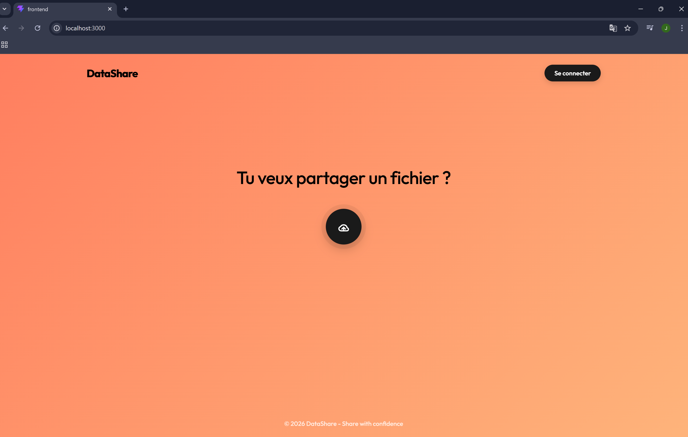
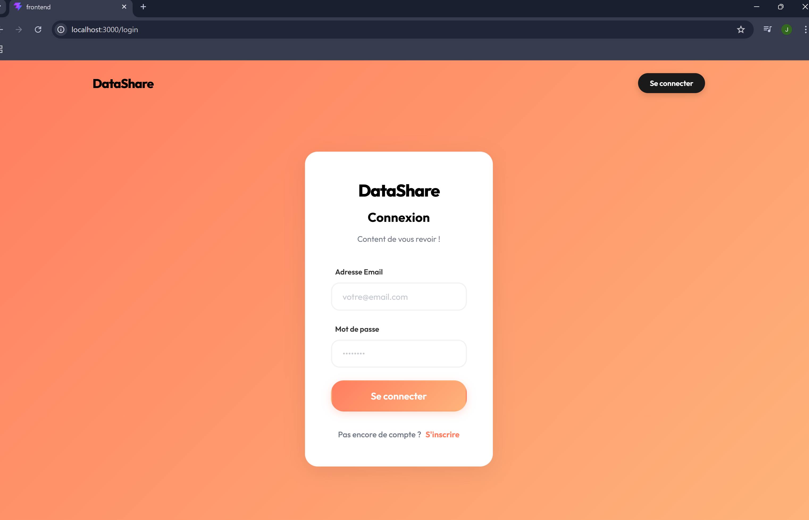
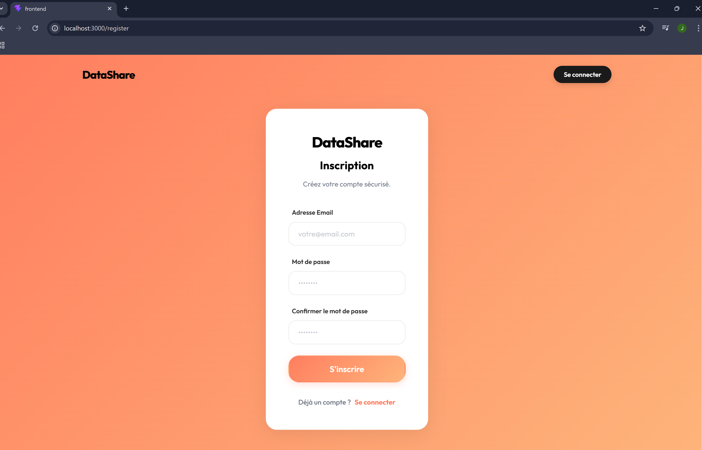
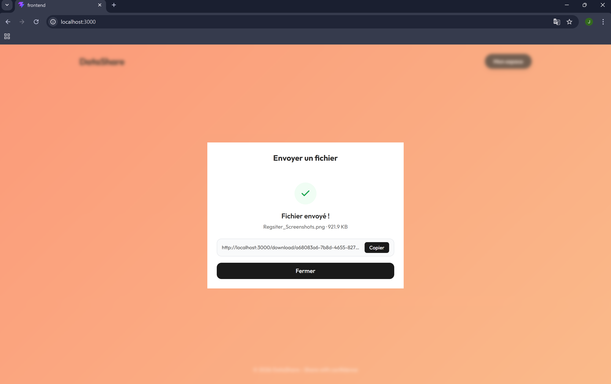
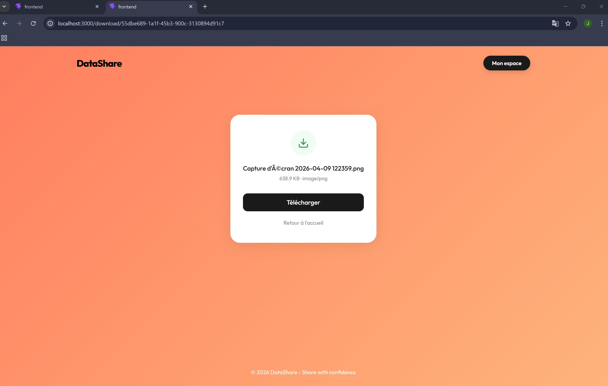
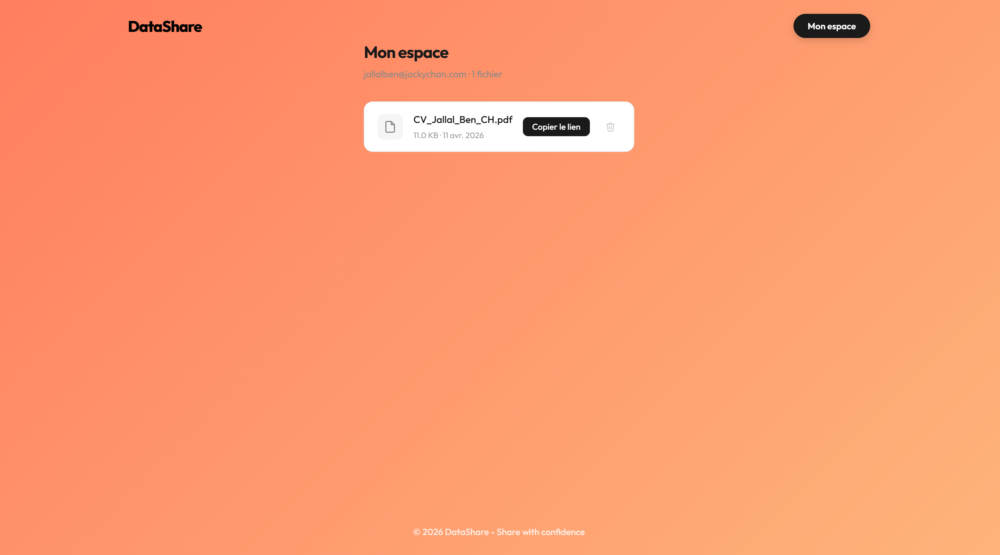
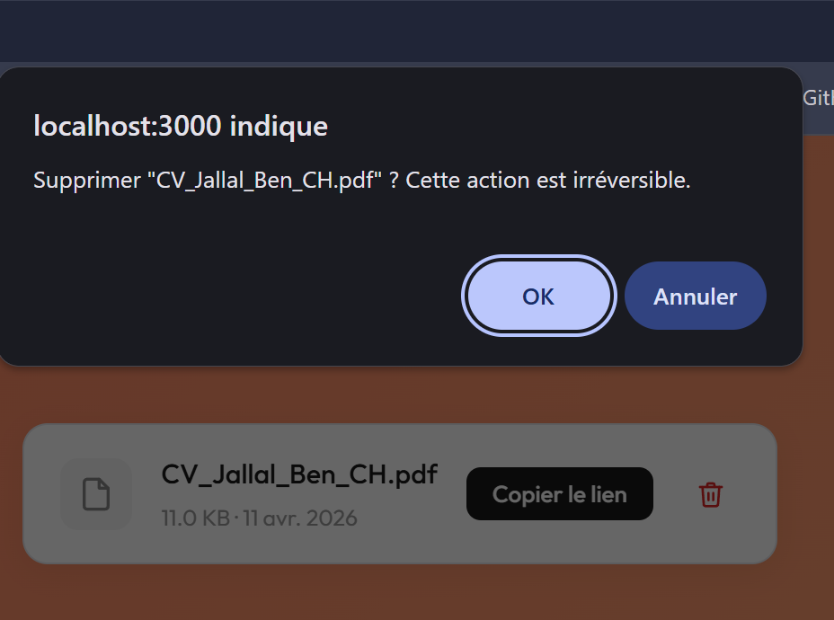

# Screenshots — DataShare Frontend

Captures d'écran de référence prises après finalisation de chaque phase.  
Chaque entrée documente l'URL, l'état visuel attendu, et le tag Git correspondant.

---

## Phase 1 — Authentification (US03/US04) — `v1.0-phase1-done`

### Accueil — `Screenshot_Main_Frame.png`

> Header fixe · Logo DataShare noir · Bouton "Se connecter" pill noir · Question centrale · Portail circulaire Cloud · Fond dégradé Sunset

**URL** : `http://localhost:3000/`  
**Design** : Conforme au Figma "Desktop-2" — minimaliste, texte noir sur dégradé orange → coral.

---

### Connexion — `Screenshot_Login.png`

> Carte blanche solide · radius 24px · Inputs Figma · Bouton orange gradient · Lien S'inscrire

**URL** : `http://localhost:3000/login`  
**Design** : Conforme au Figma "Desktop-6" — card blanche centrée, ombre légère `rgba(0,0,0,0.08)`.

---

### Inscription — `Screenshot_register.png`

> Même structure que la page de connexion · 3 champs (email, mdp, confirmation) · Bouton orange

**URL** : `http://localhost:3000/register`  
**Design** : Conforme au Figma "Desktop-7" — aligné avec la page de connexion.

---

## Phase 2 — Téléversement (US01) — `v1.0-phase2-done`

### Fichier envoyé — `Screenshot_Files_Sent.png`

> Icône check vert · Nom du fichier + poids · Lien de partage avec bouton "Copier"

**URL** : `http://localhost:3000/` → connecté → upload réussi  
**État** : succès, lien `{origin}/download/{token}` visible et copiable.

---

## Phase 3 — Téléchargement & partage (US02) — `v1.0-phase3-done`

### Page de téléchargement — `Screenshot_Download_Page.png`

> Carte centrée · Icône téléchargement · Nom du fichier + poids · Bouton "Télécharger" noir · Lien retour accueil

**URL** : `http://localhost:3000/download/{token}` (lien copié depuis l'UploadModal)  
**État** : fichier disponible, prêt au téléchargement.

---

## Phase 4 — Historique (US05) — `v1.0-phase4-done`

### Mon espace — `Screenshot_MySpace.png`

> Liste des fichiers uploadés · nom, taille, date · bouton "Copier le lien" · icône suppression

**URL** : `http://localhost:3000/myspace` — accessible uniquement connecté.

---

## Phase 5 — Suppression (US06) — `v1.0-phase5-done`

### Suppression d'un fichier — `Screenshot_Delete_Files.png`

> Confirmation native du navigateur avant suppression · fichier retiré de la liste après suppression

**URL** : `http://localhost:3000/myspace` — bouton poubelle sur chaque fichier.

---

## Tokens de design

Police : Outfit (Google Fonts)  
Dégradé fond : `#FF7E5F` → `#FEB47B` (Sunset)  
Texte principal : `#000000`  
Bordure carte : `24px` (radius Figma)

Tags Git : `v1.0-phase1-done` · `v1.0-phase2-done` · `v1.0-phase3-done` · `v1.0-phase4-done` · `v1.0-phase5-done`
